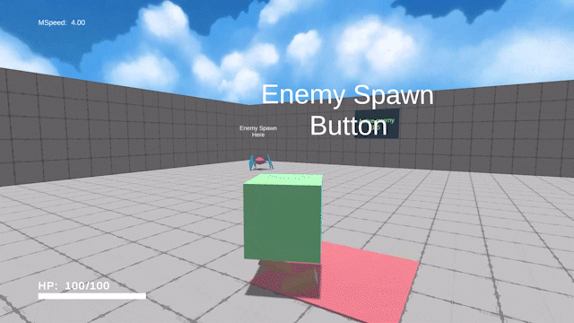

<h1 align="center">SandBoxWorld-1</h1>

## About
Проект песочница, где:
- все сделано без помощи устанавливаемых пакетов
- управление камерой сделано без "Cinemachine"
- управление персонажем без "CharacterController"
- шейдер модифицированный мной для тайлинга текстур
- шейдер для отображения здоровья врагов
- модель персонажа, врагов и пистолета сделаны мной

Sandbox project where:
- all done without the help of installed packages
- camera control done without "Cinemachine"
- character control without "CharacterController"
- shader modified by me for texture tiling
- shader to display the health of enemies
- character model, enemies and gun made by me

## Youtube Video

  

## Gif

  

